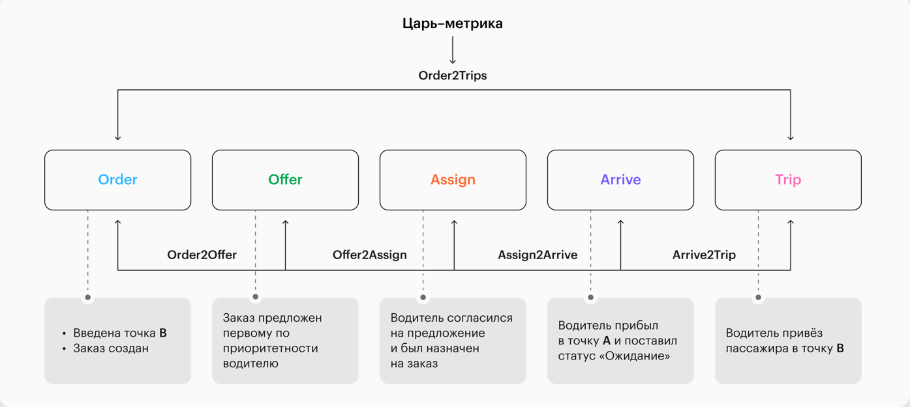
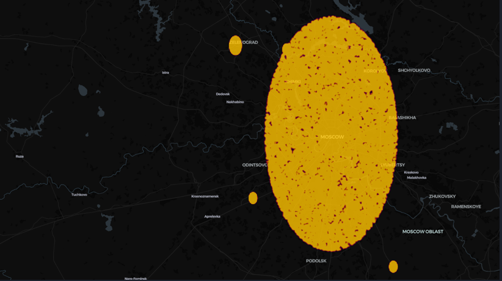

# 🚕 Product Analytics Case: Taxi Tracker Funnel Analysis  
Conversion Analysis, Metrics & Product Insights

## 🔑 TL;DR (for recruiters)

- Product analytics case focused on **funnel conversion analysis**
- End-to-end analysis: data → metrics → insights → product recommendations
- Real product context (taxi tracker)
- High feedback result and invitation to **One Day Offer (Central University × T-Bank)**

---



## 🧠 Project Overview

This repository contains a **product analytics case** completed during an intensive analytics bootcamp at **Central University**.

The project focuses on analyzing **user behavior and conversion funnel performance** in a **taxi tracker product**, with the goal of identifying bottlenecks, understanding user drop-offs, and proposing data-driven product improvements.

The work received **high evaluation feedback** and resulted in an invitation to **One Day Offer** for Central University’s master’s programs in collaboration with **T-Bank**.

---

## 📌 Goal
Analyze conversion funnel of a taxi tracker product and identify key drop-off points.


## 🗂 Repository Structure

```text
.
├── data/              # Raw and processed datasets
│
├── notebook/          # Full analytical workflow
│   └── funnel_analysis.ipynb
│
├── reports/           # Final insights & presentation
│
├── README.md
└── requirements.txt
```
## 🎯 Product Context

**Product:** Taxi tracker  
**Goal:** Track and analyze user journey from initial interaction to completed taxi order  

**Key product question:**

> Where and why do users drop out of the funnel, and how can conversion be improved?

---

## 🔍 Business Questions

The analysis addresses the following product-level questions:

- How does the conversion funnel perform at each step?
- Where are the largest user drop-offs?
- Which stages create the biggest friction?
- What product hypotheses can explain observed behavior?
- Which changes could potentially increase overall conversion?

---

## 📊 Metrics & Methodology

### Funnel Metrics

- Step-by-step conversion rates
- Drop-off rates between funnel stages
- Overall funnel conversion

### Analytical Approach

- Data cleaning and validation
- Funnel construction and visualization
- Segment-level analysis (where applicable)
- Interpretation of user behavior patterns
- Hypothesis-driven reasoning

📌 All conclusions are supported by quantitative metrics and clear visualizations.

---

## 📂 Data Description

The dataset contains event-level data describing user interactions within the taxi tracker product.

Key data characteristics:
- User-level events across funnel stages
- Timestamped interactions
- Geographic information (used for spatial analysis)
- Anonymized user identifiers

The data enables both **conversion funnel analysis** and **behavioral pattern exploration**.

---

## 📈 Analysis & Key Insights

- Identified critical funnel stages with the highest drop-off
- Quantified conversion losses between steps
- Highlighted potential UX / logic issues in user flow
- Distinguished between technical and behavioral causes of churn

Insights are presented **from a product decision-making perspective**, not just statistical results.

---



## 💡 Product Recommendations

Based on the analysis, the following product-level recommendations were formulated:

- Reduce friction at key funnel stages
- Improve clarity of user actions at critical steps
- Optimize user flow logic to minimize unnecessary exits
- Prioritize experimentation on stages with highest impact on total conversion

Each recommendation is directly linked to observed data patterns.

---

## 🛠 Tech Stack

- Python
- pandas, numpy
- matplotlib, seaborn
- Jupyter Notebook
- Kepler

---

## 🚀 Key Takeaways

- Strong product-oriented analytical thinking
- Ability to translate data into actionable insights
- Experience working with conversion funnels
- Clear focus on business and user impact
- Structured and reproducible analytical workflow

---

## 💼 Why This Project Matters

This project demonstrates the ability to:

- Analyze user behavior in real product scenarios
- Work with funnel metrics and conversion analysis
- Identify product bottlenecks using data
- Formulate hypotheses and product recommendations
- Communicate insights clearly to stakeholders

---

## 🔁 Reproducibility & Extensibility

- The analysis is fully reproducible using the provided dataset
- Funnel logic can be extended to other products or user journeys
- The notebook structure allows easy addition of new segments or metrics

---

## ⚠️ Limitations & Assumptions

- The analysis is based on observational data without controlled experiments
- Causal relationships are hypothesized, not proven
- Some user actions may be influenced by external factors not present in the data
- Funnel steps are defined based on available events and product logic assumptions

These limitations were taken into account when formulating product recommendations.

---

## 🧪 Suggested Next Steps

- Run A/B tests on key funnel stages with highest drop-off
- Improve UX copy and action clarity at critical steps
- Validate hypotheses using controlled experiments
- Extend analysis to cohort-based or retention metrics

---

## 👤 Author

**Boris Cherkasov**  
Product / Data Analyst  

- **GitHub**: https://github.com/BorDch  
- **LinkedIn**: https://www.linkedin.com/in/boris-cherkasov-data-analyst-scientist/
